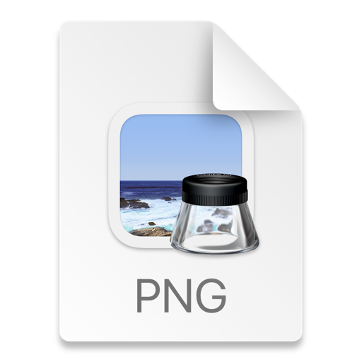

1. # Бесконечная загрузка при запуске симулятора в Android Studio
 * Условия:  Установленное приложение "ВХОСПИСЕ" версии: 1.0.0
            Эмулятор Nexus 6 API 29
 * Шаги воспроизведения:
  1. Запустить Android Studio
  2. Открыть программу с файлом приложения "ВХОСПИСЕ"
  3. Нажать иконку Debug 'app'
   _Ожидаемый результат_: Запускается эмулятор и загружается программа "ВХОСПИСЕ",прогружаясь до страницы Авторизации
   _Фактический результат_: Анимация зависает на бесконечном прокручивании колеса загрузки
   _Скриншот_: []
   
2. # Неактивность кнопки "О приложении" при нахождении в меню "Новости"
 * Условия: Установленное приложение "ВХОСПИСЕ" версии: 1.0.0
            Эмулятор Nexus 6 API 29
 * Шаги воспроизведения:
  1. Открыть приложенение
  2. Пройти авторизацию
  3. Перейти в раздел "Новости"
  4. Перейти в раздел "О приложении"
   _Ожидаемый результат_: Из раздела "Новости" переходим в раздел "О приложении"
   _Фактический результат_: Раздел "О приложении" не активна
   _Скриншот_: []
   
3. # Неактивная ссылка перехода на внешний ресурс для ознакомления с политикой конфиденциальности
 * Условия: Установленное приложение "ВХОСПИСЕ" версии: 1.0.0
            Эмулятор Nexus 6 API 29
 * Шаги воспроизведения:
  1. Открыть приложение
  2. Пройти авторизацию
  3. Перейти в раздел "О приложении"
  4. Перейти по ссылке "Политика конфиденциальности"
   _Ожидаемый результат_: Ссылка активна и ведет на сайт ознакомления с политикой конфиденциальности
   _Фактический результат_: Ссылка активна,но не открывается в браузере сайт ознакомления с политикой конфиденциальности
   _Скриншот_: []
   
4. # Неактивная ссылка перехода на внешний ресурс для ознакомления с пользовательскими соглашениями
 * Условия: Установленное приложение "ВХОСПИСЕ" версии: 1.0.0
            Эмулятор Nexus 6 API 29
 * Шаги воспроизведения:
  1. Открыть приложение
  2. Пройти авторизацию
  3. Перейти в раздел "О приложении"
  4. Перейти по ссылке "Пользовательские соглашения"
   _Ожидаемый результат_: Ссылка активна и ведет на сайт ознакомления с пользовательскими соглашениями
   _Фактический результат_: Ссылка активна,но не открывается в браузере сайт ознакомления с пользовательскими соглашениями
   _Скриншот_: []

5. # Текст с цитатой загрузочной анимации написан кириллицей,при установленном английском языке в настройках.
 *  Условия: Установленное приложение "ВХОСПИСЕ" версии: 1.0.0
             Эмулятор Nexus 6 API 29 
             Установлен английская расскладка и ввод(Меню>Система>Язык и ввод>Языки>English(United States))
 * Шаги воспроизведения:
  1. Перевести в настройках "Язык" на телефоне в режим "Английский"
  2. Открыть приложение
   _Ожидаемый результат_: Текст с цитатой загрузочной анимации переведён на язык установленный в настройках
   _Фактический результат_: Текст с цитатой анимации написан кириллицей
   _Скриншот_: [] 

6. # Заглавие новостей на главной странице написаны кириллицей,при установленном английском языке в настройках.
 *  Условия: Установленное приложение "ВХОСПИСЕ" версии: 1.0.0
             Эмулятор Nexus 6 API 29
             Установлен английская расскладка и ввод(Меню>Система>Язык и ввод>Языки>English(United States))
 * Шаги воспроизведения:
  1. Перевести в настройках "Язык" на телефоне в режим "Английский"
  2. Открыть приложение
  3. Пройти авторизацию
  4. Перейти на главную страницу
   _Ожидаемый результат_: Заглавие новостей на главной странице переведён на язык установленный в настройках
   _Фактический результат_: Заглавие новостей на главной странице написан кириллицей
   _Скриншот_: []

7. # Иконка приложения на главной странице написаны кириллицей,при установленном английском языке в настройках.
 *  Условия: Установленное приложение "ВХОСПИСЕ" версии: 1.0.0
             Эмулятор Nexus 6 API 29
             Установлен английская расскладка и ввод(Меню>Система>Язык и ввод>Языки>English(United States))
 * Шаги воспроизведения:
  1. Перевести в настройках "Язык" на телефоне в режим "Английский"
  2. Открыть приложение
  3. Пройти авторизацию
  4. Перейти на главную страницу
   _Ожидаемый результат_: Иконка приложения на главной странице переведён на язык установленный в настройках
   _Фактический результат_: Иконка на главной странице написан кириллицей
   _Скриншот_: []

8. # Текст цитат в разделе "Цитаты"(бабочка) написаны кириллицей,при установленном английском языке в настройках.
 *  Условия: Установленное приложение "ВХОСПИСЕ" версии: 1.0.0
             Эмулятор Nexus 6 API 29
             Установлен английская расскладка и ввод(Меню>Система>Язык и ввод>Языки>English(United States))
 * Шаги воспроизведения:
  1. Перевести в настройках "Язык" на телефоне в режим "Английский"
  2. Открыть приложение
  3. Пройти авторизацию
  4. Перейти в раздел "Цитаты"(бабочка)
   _Ожидаемый результат_: Текст с цитатми переведён на язык установленный в настройках
   _Фактический результат_: Текст с цитатами написан кириллицей
   _Скриншот_: []

9. # Заголовок для создания новостей в будущем написаны кириллицей,при установленном английском языке в настройках.
 *  Условия: Установленное приложение "ВХОСПИСЕ" версии: 1.0.0
             Эмулятор Nexus 6 API 29
             Установлен английская расскладка и ввод(Меню>Система>Язык и ввод>Языки>English(United States))
 * Шаги воспроизведения:
  1. Перевести в настройках "Язык" на телефоне в режим "Английский"
  2. Открыть приложение
  3. Пройти авторизацию
  4. Перейти в раздел "Новости"
  5. Перейти в подраздел "создание/редактирование" новостей
   _Ожидаемый результат_: Заголовок новости переведён на язык установленный в настройках
   _Фактический результат_: Заголовок новости написан кириллицей
   _Скриншот_: []

10. # Автор создавший новость прописан кириллицей,при установленном английском языке в настройках.
*  Условия: Установленное приложение "ВХОСПИСЕ" версии: 1.0.0
            Эмулятор Nexus 6 API 29
            Установлен английская расскладка и ввод(Меню>Система>Язык и ввод>Языки>English(United States)) 
* Шаги воспроизведения:
1. Перевести в настройках "Язык" на телефоне в режим "Английский"
2. Открыть приложение
3. Пройти авторизацию
4. Перейти в раздел "Новости"
5. Перейти в подраздел "создание/редактирование" новостей
   _Ожидаемый результат_: Автор прописан на языке установленным в настройках
   _Фактический результат_: Автор новости написан кириллицей
   _Скриншот_: []

11. # Вместо "Время создания" новости появляется поле "Дата создания" в нерелевантой форме
 *  Условия: Установленное приложение "ВХОСПИСЕ" версии: 1.0.0
            Эмулятор Nexus 6 API 29
 * Шаги воспроизведения:
  1. Открыть приложение
  2. Пройти авторизацию
  3. Перейти в раздел "Новости"
  4. Перейти в подраздел "создание/редактирование" новостей
  5. Создать новость:
   - Выбрать категорию
   - Создать заголовок
   - Добавить дату публикации
   - Указать время
   - Добавить описание
   - Нажать кнопку "Сохранить"
   _Ожидаемый результат_: Создана новость с правильно указанной датой создания
   _Фактический результат_: Указана "Дата создания" вместо "Время создания" 
   _Скриншот_: []

12. # Нет возможности перевести переключатель в режим "Не активна"
 * Условия: Установленное приложение "ВХОСПИСЕ" версии: 1.0.0
            Эмулятор Nexus 6 API 29
 * Шаги воспроизведения:
  1. Открыть приложение
  2. Пройти авторизацию
  3. Перейти в раздел "Новости"
  4. Перейти в подраздел "создание/редактирование" новостей
  5. Создать новость:
   - Выбрать категорию
   - Создать заголовок
   - Добавить дату публикации
   - Указать время
   - Добавить описание
   - Переключить кнопку-переключатель в положение "Выкл"
   - Нажать кнопку "Сохранить"
    _Ожидаемый результат_: Создана новость в не активном статусе
    _Фактический результат_: Создана новость в активном статусе
    _Скриншот_: []

13. # Выход за пределы границы поля при вводе логина и пароля в режиме максимальный для "Размер шрифта"
 * Условия: Установленное приложение "ВХОСПИСЕ" версии: 1.0.0
            Эмулятор Nexus 6 API 29
            Размер шрифта эмулятора переведён в режим "Максимальный"(Меню>Спец.возможности>Размер шрифта>Максимальный)
 * Шаги воспроизведения:
  1. Открыть приложение
  2. Ввести логин
  3. Ввести пароль
   _Ожидаемый результат_: Логин и пароль распологаются по центру и не выходят за пределы границы поля ввода
   _Фактический результат_: Логин и пароль выходят за пределы поля ввода
   _Скриншот_:  []

14. # Сбой в работе приложения при заполнение полей через автозаполнение
 * Условия: Установленное приложение "ВХОСПИСЕ" версии: 1.0.0
           Эмулятор Nexus 6 API 29
 * Шаги воспроизведения:
  1. Открыть приложение
  2. Пройти авторизацию
  3. Перейти в раздел "Новости"
  4. Перейти в подраздел "Фильтровать новости"
  5. Заполнить поле "Категория" автозаполнением(долгое нажатие в пределах поля ввода)
  6. Заполнить поле начала фильтрации "Дата" автозаполнением(долгое нажатие в пределах поля ввода)
  7. Заполнить поле завершения фильтрации "Дата" автозаполнением(долгое нажатие в пределах поля ввода)
   _Ожидаемый результат_: Не возможно заполнить поля автозаполнением
   _Фактический результат_: Поля заполняются автозаполнением.Сбой в работе приложения
   _Скриншот_:  [] [] 

15. # При тёмной теме экрана не отображается что вводиться в поля Логин и Пароль
 * Условия: Установленное приложение "ВХОСПИСЕ" версии: 1.0.0
            Эмулятор Nexus 6 API 29
            Эмулятор переведён в режим экрана "Тёмная тема"(Меню>Спец.возможности>Экран>Тёмная тема>ВКЛ.)
 * Шаги воспроизведения:
  1. Открыть приложение
  2. Ввести Логин
  3. Ввести Пароль
  4. Нажать "Войти"
    _Ожидаемый результат_: Отображается вводимые логин и пароль в полях "Логин" и "Пароль".Авторизация возможна
    _Фактический результат_: Не отображаются вводимый логин и пароль в полях "Логин" и "Пароль".Авторизация не возможна
    _Скриншот_:  []

16. # При тёмной теме экрана не отображаются цитаты
 * Условия: Установленное приложение "ВХОСПИСЕ" версии: 1.0.0
            Эмулятор Nexus 6 API 29
            Эмулятор переведён в режим экрана "Тёмная тема"(Меню>Спец.возможности>Экран>Тёмная тема>ВКЛ.)
 * Шаги воспроизведения:
  1. Открыть приложение
  2. Пройти авторизацию
  3. Перейти в раздел "Цитаты"
    _Ожидаемый результат_: Цитаты отображаются.Текст читаем
    _Фактический результат_: Цитаты отображаются очень слабо.Текст не читаем
    _Скриншот_:  []

17. # При тёмной теме экрана в разделе "Новости" не отображается дата
 * Условия: Установленное приложение "ВХОСПИСЕ" версии: 1.0.0
           Эмулятор Nexus 6 API 29
           Эмулятор переведён в режим экрана "Тёмная тема"(Меню>Спец.возможности>Экран>Тёмная тема>ВКЛ.)
 * Шаги воспроизведения:
  1. Открыть приложение
  2. Пройти авторизацию
  3. Перейти в раздел "Новости"
    _Ожидаемый результат_: Дата написания новости отображается
    _Фактический результат_: Дата написания новости не отображается
    _Скриншот_:  []

18. #  Плохо отображается меню "Панель управления" при тёмной теме экрана
 * Условия: Установленное приложение "ВХОСПИСЕ" версии: 1.0.0
            Эмулятор Nexus 6 API 29
            Эмулятор переведён в режим экрана "Тёмная тема"(Меню>Спец.возможности>Экран>Тёмная тема>ВКЛ.)
 * Шаги воспроизведения:
  1. Открыть приложение
  2. Пройти авторизацию
  3. Перейти в раздел "Новости"
  4. Перейти в подраздел "создание/редактирование" новостей
    _Ожидаемый результат_: Панель управления читаема и отображается
    _Фактический результат_: Панель управления слабо читаема
    _Скриншот_:  []

19. #  В разделе "Фильтровать новости" не отображаются текста для чек-боксов
 * Условия: Установленное приложение "ВХОСПИСЕ" версии: 1.0.0
            Эмулятор Nexus 6 API 29
            Эмулятор переведён в режим экрана "Тёмная тема"(Меню>Спец.возможности>Экран>Тёмная тема>ВКЛ.)
 * Шаги воспроизведения:
  1. Открыть приложение
  2. Пройти авторизацию
  3. Перейти в раздел "Новости"
  4. Перейти в подраздел "создание/редактирование" новостей
  5. На панели управления перейти в подраздел "Фильтровать новости"
    _Ожидаемый результат_: Текст к чек-боксу читаем
    _Фактический результат_: Текст для чек-бокса не читаем
    _Скриншот_:  []